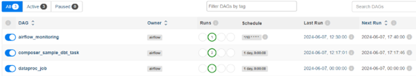

IMPORTANT ❗ ❗ ❗ Please remember to destroy all the resources after each work session. You can recreate infrastructure by creating new PR and merging it to master.


0. The goal of this phase is to create infrastructure, perform benchmarking/scalability tests of sample three-tier lakehouse solution and analyze the results using:
* [TPC-DI benchmark](https://www.tpc.org/tpcdi/)
* [dbt - data transformation tool](https://www.getdbt.com/)
* [GCP Composer - managed Apache Airflow](https://cloud.google.com/composer?hl=pl)
* [GCP Dataproc - managed Apache Spark](https://spark.apache.org/)
* [GCP Vertex AI Workbench - managed JupyterLab](https://cloud.google.com/vertex-ai-notebooks?hl=pl)

Worth to read:
* https://docs.getdbt.com/docs/introduction
* https://airflow.apache.org/docs/apache-airflow/stable/index.html
* https://spark.apache.org/docs/latest/api/python/index.html
* https://medium.com/snowflake/loading-the-tpc-di-benchmark-dataset-into-snowflake-96011e2c26cf
* https://www.databricks.com/blog/2023/04/14/how-we-performed-etl-one-billion-records-under-1-delta-live-tables.html

2. Authors:

    Grupa nr 2 w skladzie:
        - Konrad Dumin
        - Jakub Kiernozek

    Link do repozytorium: https://github.com/TeBeDe/tbd-workshop-1

    (link do repozytorium z notebook'iem: https://github.com/TeBeDe/tbd-tpc-di)

3. Sync your repo with https://github.com/bdg-tbd/tbd-workshop-1.

4. Provision your infrastructure.

    a) setup Vertex AI Workbench `pyspark` kernel as described in point [8](https://github.com/bdg-tbd/tbd-workshop-1/tree/v1.0.32#project-setup) 

    b) upload [tpc-di-setup.ipynb](https://github.com/bdg-tbd/tbd-workshop-1/blob/v1.0.36/notebooks/tpc-di-setup.ipynb) to 
the running instance of your Vertex AI Workbench

5. In `tpc-di-setup.ipynb` modify cell under section ***Clone tbd-tpc-di repo***:

   a)first, fork https://github.com/mwiewior/tbd-tpc-di.git to your github organization.

   b)create new branch (e.g. 'notebook') in your fork of tbd-tpc-di and modify profiles.yaml by commenting following lines:
   ```  
        #"spark.driver.port": "30000"
        #"spark.blockManager.port": "30001"
        #"spark.driver.host": "10.11.0.5"  #FIXME: Result of the command (kubectl get nodes -o json |  jq -r '.items[0].status.addresses[0].address')
        #"spark.driver.bindAddress": "0.0.0.0"
   ```
   This lines are required to run dbt on airflow but have to be commented while running dbt in notebook.

   c)update git clone command to point to ***your fork***.

 


6. Access Vertex AI Workbench and run cell by cell notebook `tpc-di-setup.ipynb`.

    a) in the first cell of the notebook replace: `%env DATA_BUCKET=tbd-2023z-9910-data` with your data bucket.


   b) in the cell:
         ```%%bash
         mkdir -p git && cd git
         git clone https://github.com/mwiewior/tbd-tpc-di.git
         cd tbd-tpc-di
         git pull
         ```
      replace repo with your fork. Next checkout to 'notebook' branch.
   
    c) after running first cells your fork of `tbd-tpc-di` repository will be cloned into Vertex AI  enviroment (see git folder).

    d) take a look on `git/tbd-tpc-di/profiles.yaml`. This file includes Spark parameters that can be changed if you need to increase the number of executors and
  ```
   server_side_parameters:
       "spark.driver.memory": "2g"
       "spark.executor.memory": "4g"
       "spark.executor.instances": "2"
       "spark.hadoop.hive.metastore.warehouse.dir": "hdfs:///user/hive/warehouse/"
  ```


7. Explore files created by generator and describe them, including format, content, total size.

    Wszystkie wygenerowane pliki zostaly zapisane w glownym folderze zeszytu obok 3 folderow: *Batch1*, *Batch2* oraz *Batch3*. Sumarycznie mamy wiec:
        - pliki *Batch1_audit.csv*, *Batch2_audit.csv* i *Batch3_audit.csv*; zawieraja one poczatek oraz koniec dat wewnatrz ww. folderow
        - plik *digen_report.txt*, podsumowuje on podstawowe dane nt. generacji m. in. czas trwania, liczbe rekordow etc.
        - plik *Generator_audit.csv*, zawierajacy dane dot. przebiegu calej generacji od poczatku do konca
        - folder *Batch1*, w ktorym znajduja sie pliki tekstowe z rozszerzeniem *txt* oraz bez rozszerzen, wszystkie zawieraja statystyki dot. liczby przeprowadzonych operacji tworzenia, usuwania itp.
        - foldery *Batch2* i *Batch3* o podobnej zawartosci, co *Batch1*, ale schowane w nich pliki sa krotsze


8. Analyze tpcdi.py. What happened in the loading stage?

   1. Wpierw zostaje wywolana nowa sesja Spark.
   2. Nastepnie powstaje baza danych o nazwie *Hive* z 4 warstwami: *digen*, *bronze*, *silver* i *gold*.
   3. Do kazdego przetwarzanego pliku tworzony jest odpowiadajacy mu schemat tabeli.
   4. Nastepuje wczytanie wlasciwych danych do tabel
   5. Na tabelach wykonywane sa przerozne operacje za pomoca SQL.
   6. Uzyskane dane, widoki itp. sa zapisywane do nowych plikow

9. Using SparkSQL answer: how many table were created in each layer?

   ```
        data=spark.sql(“show databases”).collect()
        layers=[a.namespace for a in data]
        for l in layers:
            spark.sql(f"use {l}")
            print(f"{l}\t{spark.sql('show tables').count()}")
   ```

   Output:

    ```
        Layer demo_bronze has 17 tables.
        Layer demo_silver has 14 tables.
        Layer demo_gold has 12 tables.
    ```

10. Add some 3 more [dbt tests](https://docs.getdbt.com/docs/build/tests) and explain what you are testing.

    Test, czy kolumna *day_of_week_desc* zawiera jakies niepoprawne dane:

    ```sql
        select * from {{ ref('dim_date') }}
        where day_of_week_desc not in ('Monday', 'Tuesday', 'Wednesday', 'Thursday', 'Friday', 'Saturday', 'Sunday')
    ```

    Test, czy nie ma rekordow z blednymi datami (zamowienie zlozone pozniej, niz usuniete):

    ```sql
        select * from {{ ref('fact_watches') }}
        where sk_date_placed > sk_date_removed
    ```

    Test, czy kolumna *sk_account_id* z tabeli *dim_account* nie zawiera powtorzen:

    ```sql
        select sk_account_id
        from {{ ref('dim_account') }}
        where sk_account_id is null
    ```

11. In main.tf update
   ```
   dbt_git_repo            = "https://github.com/mwiewior/tbd-tpc-di.git"
   dbt_git_repo_branch     = "main"
   ```
   so dbt_git_repo points to your fork of tbd-tpc-di. 

12. Redeploy infrastructure and check if the DAG finished with no errors:

    
